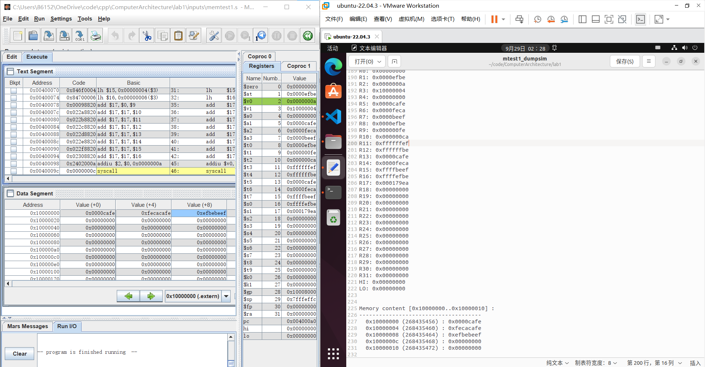

# Lab1 指令级 MIPS 模拟器

> 姓名：王茂增\
> 学号：2113972\
> 代码：https://github.com/mzwangg/ComputerArchitecture

## sim.c 整体设计

1. **process_instruction()**：处理当前指令
   1. **读取当前指令**：通过`mem_read_32(CUR_PC)`读取
   2. **解析当前指令**：通过位运算，解析出`op、rs、rt、rd、immediate、target、shamt、funct`对应的值，并保存在全局变量中
   3. **PC 加 4**：将 NEXT_PC 设为 CUR_PC + 4
   4. **分发并执行指令**：根据`op`的值，判断不同指令的类型并分别处理
      1. **0p == 0x01**：R 型指令，调用`r_fmt_ins_exec()`进行处理
         1. **r_fmt_ins_exec()**：通过`switch(funct)`，解析出不同指令，并实现相应功能
      2. **op == 0x01**: I 型分支指令
         1. **i_fmt_br_ins_exec()**：通过`switch (rt)`解析出不同指令，并实现相应功能
      3. **op == 0x02 || op == 0x03**: J 型指令
         1. **j_fmt_ins_exec()**：通过`switch (op)`解析出不同指令，并实现相应功能
      4. **else**: I 型指令
         1. **i_fmt_ins_exec()**：通过`switch (op)`解析出不同指令，并实现相应功能

## 具体实现

### 逻辑运算指令

#### and、or、xor、nor 指令

```cpp
// 可直接调用c++中的逻辑运算符，将rs和rt寄存器的值进行逻辑运算，将结果存放在rd中
NEXT_REG(rd) = CUR_REG(rs) & CUR_REG(rt); //AND
NEXT_REG(rd) = CUR_REG(rs) | CUR_REG(rt); //OR
NEXT_REG(rd) = CUR_REG(rs) ^ CUR_REG(rt); //XOR
NEXT_REG(rd) = ~(CUR_REG(rs) | CUR_REG(rt)); //NOR
```

#### andi、ori、xori 指令指令

```cpp
//可直接调用c++中的逻辑运算符，将rs寄存器的值与经无符号拓展的立即数进行逻辑运算，将结果存放在rt中
NEXT_REG(rt) = CUR_REG(rs) & (uint32_t)immediate;; //ANDI
NEXT_REG(rt) = CUR_REG(rs) | (uint32_t)immediate; //ORI
NEXT_REG(rt) = CUR_REG(rs) ^ (uint32_t)immediate;; //XORI
```

#### lui 指令

```cpp
// 加载立即数的高16位，低16位用0填充，加载到rt寄存器中
NEXT_REG(rt) = (uint32_t)immediate << 16; //LUI
```

### 移位指令

#### sll、sllv，sra、srav、srl、srlv 指令

```cpp
// 逻辑左移、右移指令，直接使用<<或>>即可，对rt进行运算，结果储存在rd中
NEXT_REG(rd) = CUR_REG(rt) << shamt; //SLL
NEXT_REG(rd) = CUR_REG(rt) >> shamt; //SRL

// 算数右移指令，先将数据转为有符号整数，再右移即可，对rt进行运算，结果储存在rd中
NEXT_REG(rd) = (int32_t)CUR_REG(rt) >> shamt; //SRA

// 算数左移、右移，移动位数为rs寄存器的后五位，所以通过& 0x1F得到低五位的值，结果保存在rd寄存器中
NEXT_REG(rd) = CUR_REG(rt) << (CUR_REG(rs) & 0x1F); //SLLV
NEXT_REG(rd) = (int32_t)CUR_REG(rt) >> (CUR_REG(rs) & 0x1F); //SRLV

// 类似SRLV指令，不过是算数右移，所以将rt寄存器的值转为有符号整数
NEXT_REG(rd) = (int32_t)CUR_REG(rt) >> (CUR_REG(rs) & 0x1F); // SRAV
```

### 算数操作指令

#### add、addu、sub、subu、slt，sltu 指令

```cpp
// add与addu、sub与subu的区别在于是否进行溢出检测，由于Lab1暂时不实现，所以两者的命令一样
// rs寄存器的值 +/- rt寄存器的值，结果保存在rd中
NEXT_REG(rd) = CUR_REG(rs) + CUR_REG(rt); //ADD
NEXT_REG(rd) = CUR_REG(rs) + CUR_REG(rt); //ADDU
NEXT_REG(rd) = CUR_REG(rs) - CUR_REG(rt); //SUB
NEXT_REG(rd) = CUR_REG(rs) - CUR_REG(rt); //SUBU


// SLT和SLTU的区别在于处理的是有符号数还是无符号数
// 所以SLT要是用(int32_t)进行类型转换
// 如果rs寄存器的值小于rt寄存器的值则将rd寄存器置为1，否则置为0
NEXT_REG(rd) = (int32_t)CUR_REG(rs) < (int32_t)CUR_REG(rt); //SLT
NEXT_REG(rd) = CUR_REG(rs) < CUR_REG(rt); //SLTU
```

#### addi，addiu、slti、sltiu 指令

```cpp
// addi与addiu的区别在于是否进行溢出检测，由于Lab1暂时不实现，所以两者的命令一样
// 对于符号拓展，由于immediate为uint16_t类型，我们要先将其转为int16_t，再转为int32_t
// 将rs寄存器的值加上符号拓展的立即数再保存在rt中
NEXT_REG(rt) = CUR_REG(rs) + (int32_t)(int16_t)immediate; //ADDI
NEXT_REG(rt) = CUR_REG(rs) + (int32_t)(int16_t)immediate; //ADDIU

// slti、sltiu的区别在于处理的是有符号数还是无符号数
// 两者均需要进行符号拓展，所以对于SLTIU，需要进行(uint32_t)(int32_t)(int16_t)的转换，先转为符号拓展的32位有符号整数，再转为无符号
// 如果rs寄存器的值小于符号拓展的立即数，则将rt寄存器置为1，否则置为0
NEXT_REG(rt) = (int32_t)CUR_REG(rs) < (int32_t)(int16_t)immediate; //SLTI
NEXT_REG(rt) = CUR_REG(rs) < (uint32_t)(int32_t)(int16_t)immediate; //SLTIU
```

#### multu、mult 指令

```cpp
// MULT
// 有符号乘法指令，将结果的低32位保存在NEXT_LO，高32位保存在NEXT_HI
NEXT_HI = ((int64_t)CUR_REG(rs) * (int64_t)CUR_REG(rt)) >> 32;
NEXT_LO = ((int64_t)CUR_REG(rs) * (int64_t)CUR_REG(rt)) & 0xFFFFFFFF;

//MULTU
// 无符号乘法指令，将结果的低32位保存在NEXT_LO，高32位保存在NEXT_HI
NEXT_HI = ((uint64_t)CUR_REG(rs) * (uint64_t)CUR_REG(rt)) >> 32;
NEXT_LO = ((uint64_t)CUR_REG(rs) * (uint64_t)CUR_REG(rt)) & 0xFFFFFFFF;
```

#### divu、div 指令

```cpp
// DIV为有符号除法指令，NEXT_LO保存除数，NEXT_HI保存余数
if (CUR_REG(rt) != 0) {
    NEXT_LO = (int32_t)CUR_REG(rs) / (int32_t)CUR_REG(rt);
    NEXT_HI = (int32_t)CUR_REG(rs) % (int32_t)CUR_REG(rt);
} else {
    printf("除数不能为0! ");
}

// DIVU为无符号除法指令，NEXT_LO保存除数，NEXT_HI保存余数
if (CUR_REG(rt) != 0) {
    NEXT_LO = CUR_REG(rs) / CUR_REG(rt);
    NEXT_HI = CUR_REG(rs) % CUR_REG(rt);
} else {
    printf("除数不能为0! ");
}
```

### 转移指令

### jr、jalr、j、jal（跳转指令）

```cpp
// JR为跳转指令，将下一个PC设置为rs寄存器的值
NEXT_PC = CUR_REG(rs);

// JALR使用rd保存下一PC的值，然后跳转到rs寄存器指定的地址
NEXT_REG(rd) = NEXT_PC;
NEXT_PC = CUR_REG(rs);

// J为无条件跳转，PC的高四位不变，低28位由target给出，其中NEXT_PC已经PC+4
NEXT_PC = (NEXT_PC & 0xF0000000) | (target << 2);


// 对于JAL指令，首先将PC+4的值保存在$31寄存器
NEXT_REG(31) = CUR_PC + 4;
// 无条件跳转，PC的高四位不变，低28位由target给出，其中NEXT_PC已经PC+4
NEXT_PC = (NEXT_PC & 0xF0000000) | (target << 2);
```

#### beq、bne、bgez、bgezal、bltz、bltzal、bgtz、blez（分支指令）

```cpp
//分支指令的目标地址均为立即数符号拓展并左移两位的地址+PC+4，其中PC+4已经在其他地方实现

//BEQ和BNE分别在rs和rt寄存器的值相等时分支
if (CUR_REG(rs) == CUR_REG(rt)) { //BEQ
    NEXT_PC += ((int32_t)(int16_t)immediate << 2);
}
if (CUR_REG(rs) != CUR_REG(rt)) { //BNE
    NEXT_PC += ((int32_t)(int16_t)immediate << 2);
}

// BGEZ指令和BGEZAL指令均在寄存器值大于等于0时分支，不过BGRZAL会同时将下一PC写入寄存器$31
if ((int32_t)CUR_REG(rs) >= 0) //BGEZ
    NEXT_PC += ((int32_t)(int16_t)immediate << 2);
if ((int32_t)CUR_REG(rs) >= 0) { //BGEZAL
    NEXT_REG(31) = NEXT_PC;
    NEXT_PC += ((int32_t)(int16_t)immediate << 2);
}

// BLTZ和BLTZAL与BGEZ指令和BGEZAL指令类似，不过是在小于0时分支
if ((int32_t)CUR_REG(rs) < 0) //BLTZ
    NEXT_PC += ((int32_t)(int16_t)immediate << 2);
if ((int32_t)CUR_REG(rs) < 0) {
    NEXT_REG(31) = NEXT_PC; //BLTZAL
    NEXT_PC += ((int32_t)(int16_t)immediate << 2);
}

// BGTZ为大于则分支，立即数符号拓展并左移两位,其中NEXT_PC已经PC+4
if ((int32_t)CUR_REG(rs) > 0)
    NEXT_PC += ((int32_t)(int16_t)immediate << 2);
break;

// BLEZ为小于等于则分支，立即数符号拓展并左移两位,其中NEXT_PC已经PC+4
if ((int32_t)CUR_REG(rs) <= 0)
    NEXT_PC += ((int32_t)(int16_t)immediate << 2);
```

### 加载存储指令

对于加载存储指令，都需要读取和写入数据到内存中。但是我们要保证读取和写入的地址 4 字节对齐，所以我们首先定义如下变量：

- address: 写入或读取的地址，通过符号拓展的 immediate 再加上 rs 寄存器的值计算
- address_aligned: 在 address 之前且最近的四字节对齐地址，我们读取和写入都要针对这个地址进行
- address_data: 上述对齐地址处的值

```cpp
uint32_t address = (uint32_t)(int32_t)(int16_t)immediate + CUR_REG(rs); // 计算address
uint32_t address_aligned = address & 0xfffffffc; // address & 0xfffffffc使address4字节对齐
uint32_t address_data = mem_read_32(address_aligned); // 读取对齐后address的位置
```

#### lb、lbu、Lh、Lhu、lw 指令

对于上述指令，我着重介绍一下 LB 指令是如何实现的，其他指令的实现方法类似。

对于 LB 指令，可以读取任意地址处的字节，不过我们只能读取四字节对齐地址的值，所以需要进行处理。我们首先通过`(address & 0x3) << 3`计算得到 LB 指令读取位置相对于四字节对齐地址的偏移量，然后通过`(address_data & (0xff << shift_lb))`取出目标地址的数据，并通过`>> shift_lb)`将该数据移到最低位，最后进行符号拓展得到对应位置的值。

```cpp
// LB指令
int16_t shift_lb = (address & 0x3) << 3;
NEXT_REG(rt) = (int32_t)(int8_t)(((address_data & (0xff << shift_lb)) >> shift_lb));
```

```cpp
//LBU指令
int16_t shift_lbu = (address & 0x3) << 3;
NEXT_REG(rt) = (uint32_t)(((address_data & (0xff << shift_lbu)) >> shift_lbu));

//LH指令
if (address & 0x1) { // 当地址的最低位不是零时发生地址错误
    printf("地址错误!\n");
} else {
    int16_t shift_lh = (address & 0x2) << 3;
    NEXT_REG(rt) = (int32_t)(int16_t)(((address_data & (0xffff << shift_lh)) >> shift_lh));
}

//LHU指令
if (address & 0x1) { // 当地址的最低位不是零时发生地址错误
    printf("地址错误!\n");
} else {
    int16_t shift_lhu = (address & 0x2) << 3;
    NEXT_REG(rt) = (uint32_t)(((address_data & (0xffff << shift_lhu)) >> shift_lhu));
}

//LW指令
if (address & 0x3) { // 当地址的低两位不是零时发生地址错误
    printf("地址错误!\n");
} else {
    NEXT_REG(rt) = mem_read_32(address);
}
```

#### sb、sh、sw 指令

同样的，对于上述指令，我们需要写入一个不一定四字节对齐的位置，下面我以 SB 指令为例进行介绍。

对于 SB 地址，我们， 仍然通过`(address & 0x3) << 3`计算得到 SB 指令写入位置相对于四字节对齐地址的偏移量，然后通过`address_data &= ~(0xFF << shift_sb)`清除原始数据的相应 8 位位置， 然后通过指令`address_data |= ((CUR_REG(rt) & 0xff) << shift_sb)`对这八位地址进行写入，最后`mem_write_32(address_aligned, address_data)`写到内存的相应位置。

```cpp
// SB指令
// 计算要加载位置的偏移量
int16_t shift_sb = (address & 0x3) << 3;
// 清除原始数据的相应8位位置
address_data &= ~(0xFF << shift_sb);
// 将rt寄存器的低8位值存储到原始数据的相应位置
address_data |= ((CUR_REG(rt) & 0xff) << shift_sb);
// 将修改后的数据写回到内存
mem_write_32(address_aligned, address_data);
```

```cpp
// SH指令
if (address & 0x1) { // 当地址的最低位不是零时发生地址错误
    printf("地址错误!\n");
} else {
    // 计算要加载位置的偏移量
    int16_t shift_sh = (address & 0x2) << 3;
    // 清除原始数据的相应16位位置
    address_data &= ~(0xFFFF << shift_sh);
    // 将rt寄存器的低16位值存储到原始数据的相应位置
    address_data |= ((CUR_REG(rt) & 0xffff) << shift_sh);
    // 将修改后的数据写回到内存
    mem_write_32(address_aligned, address_data);
}

// SW指令
if (address & 0x3) { // 当地址的低两位不是零时发生地址错误
    printf("地址错误!\n");
} else {
    mem_write_32(address, CUR_REG(rt));
}
```

## 实验验证

### 验证方法

Mars 模拟器是一个用于 MIPS 架构汇编语言和机器码的模拟和调试工具。这个模拟器主要用于教育目的，帮助学生和程序员理解计算机体系结构和汇编语言编程。

在实验中，我使用 Mars 将`inputs`文件夹中的.s 文件转为.x 文件，并逐步执行代码与本项目的结果进行对照，本项目逐步执行结果可在`dumpsim`文件夹中找到。通过逐步对照，结果表明，本项目的实现完全正确。

### 增加测试程序

除此之外，本项目还编写了一个测试文件`my_test.s`，包含了逻辑运算、算术运算、跳转指令、加载存储指令等，从而更全面地验证了程序的正确性。下面是`my_test.s`文件内容：

```mips
.data
    array: .space 16  # 用于存储数据的数组
    result: .word 0   # 用于存储计算结果的变量

.text
    main:
        # 初始化数据
        ori $t0, $zero, 10  # 将寄存器$t0初始化为10
        ori $t1, $zero, 3   # 将寄存器$t1初始化为3
        sw $t0, array       # 存储$t0的值到数组
        sw $t1, array + 4   # 存储$t1的值到数组的下一个位置

        # 加法
        lw $t2, array       # 从数组加载数据到$t2
        add $t3, $t0, $t1   # 计算$t0 + $t1
        add $t4, $t2, $t3   # 计算$t2 + $t3

        # 减法
        sub $t5, $t4, $t2   # 计算$t4 - $t2

        # 乘法
        mult $t5, $t1   # 计算$t5 * $t1

        # 除法
        div $t7, $t5, $t0   # 计算$t6 / $t0

        # 分支跳转
        beq $t7, $t1, equal
        bne $t7, $t1, not_equal

    equal:
        ori $t8, $zero, 1
        j end

    not_equal:
        ori $t8, $zero, 0

    end:
        # 存储计算结果到result变量
        sw $t8, result

        # 终止程序
        addiu $v0, $zero, 10
        syscall
```

### 验证结果

最后，我将附上每一个实验最后的寄存器和内存结果与 Mars 运行结果的对照图，以说明程序的正确性。可以看到，寄存器和内存与 Mars 的运行结果一致。

#### daddiu


#### arithtest


#### brtest0


#### brtest1


#### brtest2


#### mtest0


#### mtest1



#### my_test

